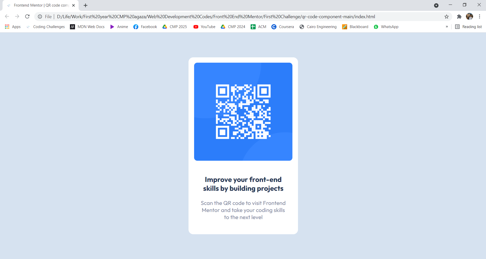

# Frontend Mentor - QR code component solution

This is a solution to the [QR code component challenge on Frontend Mentor](https://www.frontendmentor.io/challenges/qr-code-component-iux_sIO_H). Frontend Mentor challenges help you improve your coding skills by building realistic projects. 

## Table of contents

- [Overview](#overview)
  - [Screenshot](#screenshot)
  - [Links](#links)
- [My process](#my-process)
  - [Built with](#built-with)
  - [What I learned](#what-i-learned)
  - [Continued development](#continued-development)
  - [Useful resources](#useful-resources)
- [Author](#author)
- [Acknowledgments](#acknowledgments)

## Overview
This took me below 2 hours. It is the first html & css project I have done.
### Screenshot

### Links

- Live Site URL: [Add live site URL here](https://your-live-site-url.com)

## My process
html took me about 30 minutes to code. Then, I dived into css. At first, the paragraphs weren't getting any changes in them. Then, I realized I had to say '#' before the word I have to style. This took alot to figure out.
Then, started with making the content centered. I failed at that so took half an hour break. After, the project was finished smoothely.

### Built with

- Semantic HTML5 markup
- CSS custom properties
- Flexbox

### What I learned
It can be frustrating at first trying to figure out why the content isn't lining up as you imagine it to be. So, be patient and refer to internet resources like MDN and you'll get the hang of it.

### Useful resources

- [Example resource 1](https://developer.mozilla.org/en-US/docs/Web/HTML) - This helped me for returning back to the basics of html.
- [Example resource 2](https://developer.mozilla.org/en-US/docs/Web/CSS) - This is an amazing article which helped me finally understand css. I'd recommend it to anyone still learning this concept.

## Author

- Frontend Mentor - [@goushaa](https://www.frontendmentor.io/profile/goushaa)

